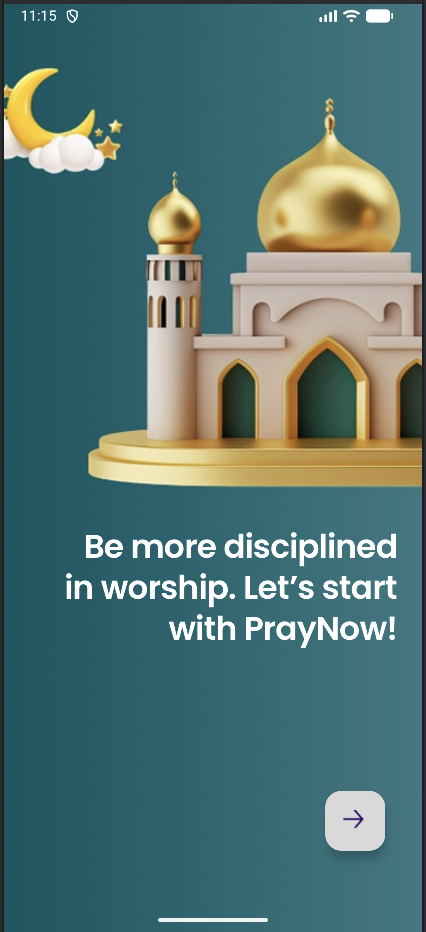
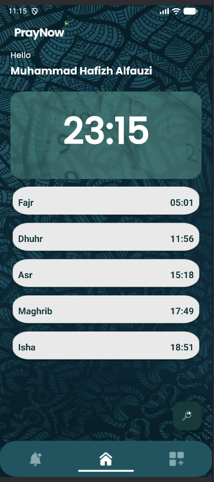
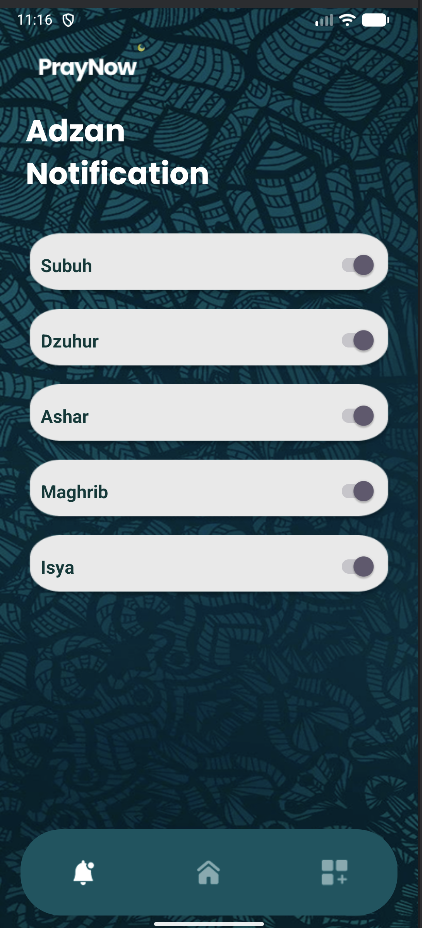
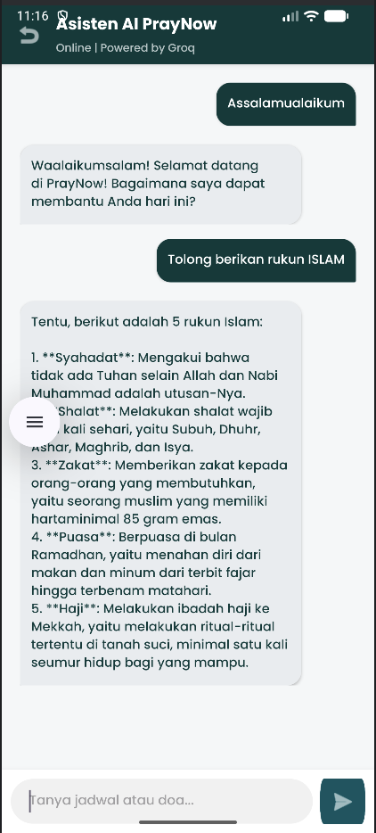
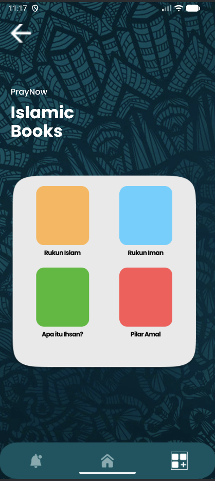

<div align="center">

  

  <h1>PRAYNOW</h1>
  <p><strong>Aplikasi Pengingat Sholat, Jadwal Otomatis & AI Chat Islami</strong></p>

  <p>
    
    
    
    
    
  </p>

</div>

---

## 📖 Deskripsi

**PRAYNOW** adalah aplikasi Android all-in-one yang dirancang khusus untuk membantu umat Muslim dalam:
- Mengingat waktu sholat dengan **jadwal otomatis berbasis lokasi**
- Mengakses **koleksi buku Islam** sebagai sumber pembelajaran
- Berinteraksi dengan **AI Chat Islami** untuk tanya-jawab keislaman
- Mendapatkan **notifikasi & alarm adzan** tepat waktu

Dibangun dengan pendekatan **UI/UX sederhana & user-friendly**, PRAYNOW hadir sebagai solusi praktis ibadah dan belajar dalam satu genggaman.

---

## 📸 Screenshot
### Onboarding & Branding
| Logo / Splash | Opening Screen | Greeting Screen |
|:---:|:---:|:---:|
|  |  |  |

### Jadwal & Pengingat
| Jadwal Sholat | Notifikasi & Alarm |
|:---:|:---:|
|  |  |

### AI & Edukasi
| AI Chat Islami | Library Buku | Detail Buku |
|:---:|:---:|:---:|
|  |  |  |

---

## ✨ Fitur Utama

| Fitur | Deskripsi | Status |
|-------|-----------|--------|
| 🕌 **Jadwal Sholat Otomatis** | Mengambil jadwal sholat real-time berdasarkan koordinasi GPS / lokasi pengguna | ✅ Ready |
| ⏰ **Notifikasi & Alarm Adzan** | Push notification & alarm custom untuk setiap waktu sholat | ✅ Ready |
| 📚 **Library Buku Islam** | Koleksi buku-buku Islam yang bisa dibaca langsung dalam aplikasi | ✅ Ready |
| 🤖 **AI Chat Islami** | Asisten AI untuk menjawab pertanyaan seputar Islam & fiqih | ✅ Ready |
| 📍 **Deteksi Lokasi** | Auto-detect lokasi atau pilih manual dengan berbagai metode perhitungan | ✅ Ready |
| 🌙 **Onboarding Interaktif** | Pengenalan aplikasi yang menarik saat pertama kali buka | ✅ Ready |
| 🎨 **UI Sederhana** | Desain clean, minimalis, dan mudah digunakan semua kalangan | ✅ Ready |

---

## 🛠️ Tech Stack

### Mobile Development
- **Android Studio** — IDE utama
- **Kotlin** — Bahasa pemrograman utama
- **Java** — Dukungan tambahan (jika ada modul legacy)
- **XML / Jetpack Compose** — UI Layout

### API & Data
- **Aladhan API / MyQuran API / Kemenag API** — Sumber data jadwal sholat
- **Retrofit / OkHttp** — HTTP Client untuk konsumsi API
- **Room Database** — Local caching & penyimpanan buku
- **SharedPreferences / DataStore** — Penyimpanan preferensi user

### Lainnya
- **Firebase Cloud Messaging (FCM)** — Push notification
- **Google Play Location Services** — Deteksi lokasi GPS
- **OpenAI API / Gemini API** — Backend AI Chat (opsional self-hosted)

---

## 📁 Struktur Folder

```bash
PrayNow/
├── 📂 app/
│   ├── 📂 src/main/
│   │   ├── 📂 java/com/moviezal/praynow/
│   │   │   ├── 📂 ui/                  # Activity & Fragment
│   │   │   ├── 📂 data/                # Repository & Data Source
│   │   │   ├── 📂 model/               # Data classes (POKO)
│   │   │   ├── 📂 adapter/             # RecyclerView Adapters
│   │   │   ├── 📂 network/             # API Interface & Retrofit Client
│   │   │   ├── 📂 database/            # Room Entities & DAO
│   │   │   ├── 📂 utils/               # Helper & Extension Functions
│   │   │   └── 📂 viewmodel/           # MVVM ViewModels
│   │   ├── 📂 res/                     # Layout, Drawable, Values
│   │   └── 📂 assets/                  # Buku PDF / JSON static
│   └── 📂 build.gradle                 # App-level Gradle
├── 📂 screenshots/                     # 📸 Screenshot aplikasi (untuk README)
│   ├── logo.png
│   ├── opening.png
│   ├── greeting.png
│   ├── jadwal.png
│   ├── notifikasi.png
│   ├── ai.png
│   ├── library.png
│   └── book.png
├── 📂 docs/                            # Dokumentasi tambahan
├── 📄 build.gradle (Project)
├── 📄 settings.gradle
├── 📄 gradle.properties
└── 📄 README.md                        # 📌 File ini
```

---

## ⚙️ Instalasi

Ikuti langkah-langkah berikut untuk menjalankan project ini secara lokal:

### Prasyarat
- [Android Studio](https://developer.android.com/studio) Hedgehog (2023.1.1) atau lebih baru
- JDK 17+
- Android SDK API 34 (compileSdk)
- Minimum API 24 (Android 7.0 Nougat)

### Langkah-langkah

1. **Clone repository**
   ```bash
   git clone https://github.com/Moviezal/PrayNow.git
   cd PrayNow
   ```

2. **Buka di Android Studio**
   - Pilih `File > Open` dan arahkan ke folder `PrayNow`
   - Tunggu Gradle sync selesai

3. **Tambahkan API Key (jika diperlukan)**
   - Buat file `local.properties` di root project (jika belum ada)
   - Tambahkan key yang dibutuhkan:
     ```properties
     BASE_URL_JADWAL="https://api.aladhan.com/v1/"
     API_KEY_AI="your_openai_or_gemini_api_key"
     ```

4. **Build & Run**
   - Pilih device/emulator (API 24+)
   - Klik tombol **Run** ▶️ atau tekan `Shift + F10`

---

## 🎮 Penggunaan

| Langkah | Aksi |
|---------|------|
| 1 | Buka aplikasi, tunggu **Splash Screen** |
| 2 | Lewati atau ikuti **Opening Screen** onboarding |
| 3 | Izinkan akses **Lokasi** untuk jadwal otomatis |
| 4 | Atur **metode perhitungan** & madzhab sesuai preferensi |
| 5 | Lihat **Jadwal Sholat** harian di halaman utama |
| 6 | Aktifkan **Alarm/Notifikasi** untuk waktu sholat pilihan |
| 7 | Akses **Library** untuk membaca buku Islam |
| 8 | Gunakan **AI Chat** untuk bertanya seputar Islam |

---

## 🔗 Link Project

| Resource | Link |
|----------|------|
| 🐙 GitHub Repository | [github.com/Moviezal/PrayNow](https://github.com/Moviezal/PrayNow) |
| 📋 SCRUM Board (ClickUp) | [ClickUp/PrayNow](https://app.clickup.com/90181837079/v/li/901812053540) |
---

## 🗺️ Roadmap

- [x] Splash & Onboarding Screen
- [x] Jadwal Sholat berbasis lokasi
- [x] Alarm & Notifikasi Adzan
- [x] Library Buku Islam (offline)
- [x] AI Chat Islami
- [ ] Widget Home Screen jadwal sholat
- [ ] Qibla Compass (Kiblat)
- [ ] Dark Mode support
- [ ] Multi-bahasa (Indonesia, English, Arab)
- [ ] Integrasi Google Calendar

---

## 🤝 Kontribusi

Kontribusi selalu terbuka! Jika ingin berkontribusi:

1. Fork repository ini
2. Buat branch baru (`git checkout -b feature/fitur-keren`)
3. Commit perubahan (`git commit -m 'Menambahkan fitur keren'`)
4. Push ke branch (`git push origin feature/fitur-keren`)
5. Buka **Pull Request**


⸻

📜 Lisensi

Proyek ini didistribusikan di bawah lisensi MIT License, yang memberikan kebebasan kepada siapa pun untuk menggunakan, menyalin, memodifikasi, dan mendistribusikan perangkat lunak ini, dengan tetap mencantumkan atribusi kepada pengembang asli.

Untuk informasi lebih lanjut, silakan lihat file LICENSE.

⸻

<div align="center">
  <p><strong>Dikembangkan dengan dedikasi untuk mendukung kemudahan ibadah umat Muslim</strong></p>
  <p>© 2026 — PRAYNOW Team. All rights reserved.</p>
</div>
